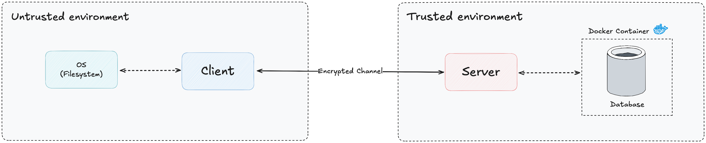

<p align="center">
  <h1 align="center">SecureFS</h1>
  <p align="center">An encrypted virtual file system with client-server architecture, built in Rust.</p>
</p>

<p align="center">
  <a href="LICENSE"></a>
  
  
</p>

---

## Installation

```sh
# Clone
git clone https://github.com/Adel-Ayoub/securefs.git
cd securefs

# Start database
docker-compose up -d

# Build
cargo build --release

# Run server
cargo run --bin securefs-server

# Run client (in new terminal)
cargo run --bin securefs
```

---

## Architecture

<p align="center">
  
</p>

SecureFS implements a client-server model over encrypted WebSocket channels. The client sends commands through an AES-256-GCM encrypted tunnel established via X25519 key exchange. The server processes file operations against a PostgreSQL database where all metadata is encrypted with pgcrypto.

### Security Layers

<p align="center">
  
</p>

| Layer | Technology | Purpose |
|-------|-----------|---------|
| Transport | AES-256-GCM over WebSocket | Message confidentiality |
| Key Exchange | X25519 ECDH + HKDF-SHA256 | Ephemeral session keys |
| Authentication | Argon2id | Password hashing with rate limiting |
| Database | pgcrypto | Symmetric encryption for all metadata |
| Integrity | BLAKE3 | File corruption detection |

### Data Flow

<p align="center">
  
</p>

### Database Schema

<p align="center">
  
</p>

---

## Requirements

| Dependency | Version |
|-----------|---------|
| Rust | 1.70+ |
| PostgreSQL | 13+ |
| Docker | 20+ |
| Docker Compose | v2+ |

---

## Features

### Completed

- **End-to-End Encryption** — AES-256-GCM transport with X25519 key exchange
- **Unix-style Permissions** — Owner/group/other rwx bits with chmod, chown, chgrp
- **File Operations** — ls, cd, pwd, mkdir, touch, cat, echo, mv, delete, cp, find
- **User & Group Management** — User creation, group assignment, admin tools
- **Integrity Verification** — BLAKE3 hash checks via `scan` command
- **Recursive Copy** — Deep copy of files and directories
- **File Search** — Pattern-based recursive file search with `find`
- **File Metadata** — Size and timestamp tracking
- **Rate Limiting** — Login attempt throttling per IP
- **TLS Enforcement** — Mandatory TLS unless explicitly disabled
- **CI Pipeline** — GitHub Actions with clippy, fmt, and test checks
- **Docker Support** — Multi-stage Dockerfile for server deployment

### Planned

- [ ] Large file streaming
- [ ] Command history & tab completion
- [ ] File compression (compress-then-encrypt)

---

## Build Targets

| Crate | Binary | Description |
|-------|--------|-------------|
| `securefs-server` | `securefs-server` | WebSocket server with TLS, encryption, and DAO layer |
| `securefs-client` | `securefs` | Interactive CLI client with key exchange |
| `securefs-model` | — (library) | Shared protocol, commands, and data types |

---

## Usage

### Server

```sh
# Start PostgreSQL
docker-compose up -d

# Start server (default: 127.0.0.1:8080)
cargo run --bin securefs-server

# Environment variables
export SERVER_ADDR=127.0.0.1:8080
export DB_PASS=securefs
```

### Client

```sh
# Connect
cargo run --bin securefs

# Login (default admin: admin / password)
> login admin password

# File operations
> pwd
/home/admin
> mkdir projects
> cd projects
> touch README.md
> echo "Hello SecureFS" README.md
> cat README.md
Hello SecureFS

# Copy and search
> cp README.md backup.md
> find README
/home/admin/projects/README.md
/home/admin/projects/backup.md

# Integrity check
> scan README.md
Ensured integrity of README.md!

# Permissions
> chmod 750 README.md
> chown admin README.md
> chgrp developers README.md
> ls
-rwxr-x--- admin README.md

# User management (admin only)
> newuser alice pass1234 developers
> newgroup engineering
> add_user_to_group alice engineering

> logout
```

---

## Commands

### File System

| Command | Description |
|---------|-------------|
| `ls` | List directory contents |
| `cd <path>` | Change directory |
| `pwd` | Print working directory |
| `mkdir <name>` | Create directory |
| `touch <name>` | Create empty file |
| `cat <file>` | Display file contents |
| `echo <content> <file>` | Write content to file |
| `mv <src> <dst>` | Move/rename file or directory |
| `delete <name>` | Delete file or directory |
| `cp <src> <dst>` | Copy file or directory (recursive) |
| `find <pattern>` | Search for files by name |

### Security & Permissions

| Command | Description |
|---------|-------------|
| `chmod <mode> <name>` | Change file permissions (e.g. `750`) |
| `chown <user> <name>` | Change file owner |
| `chgrp <group> <name>` | Change file group |
| `scan <file>` | Verify file integrity via BLAKE3 |

### User Management (Admin)

| Command | Description |
|---------|-------------|
| `newuser <user> <pass> <group>` | Create new user |
| `newgroup <name>` | Create new group |
| `lsusers` | List all users |
| `lsgroups` | List all groups |
| `add_user_to_group <user> <group>` | Add user to group |
| `remove_user_from_group <user> <group>` | Remove user from group |

### Session

| Command | Description |
|---------|-------------|
| `login <user> <pass>` | Authenticate |
| `logout` | End session |

---

## Project Structure

```
securefs/
├── Cargo.toml                  # Workspace root
├── docker-compose.yml          # PostgreSQL service
├── db/
│   └── schema.sql              # Database schema with pgcrypto
├── docker/
│   └── Dockerfile.server       # Multi-stage server build
├── model/
│   └── src/
│       ├── lib.rs              # Re-exports
│       ├── cmd.rs              # Command enum and argument parsing
│       └── protocol.rs         # AppMessage, FNode, User, Group types
├── server/
│   ├── src/
│   │   ├── main.rs             # TLS setup, WebSocket listener
│   │   ├── lib.rs              # DAO module + audit macro
│   │   ├── session.rs          # Session state and rate limiter
│   │   ├── crypto.rs           # AES-256-GCM encrypt/decrypt
│   │   ├── util.rs             # Path resolution, permissions, validation
│   │   ├── dao/
│   │   │   ├── mod.rs
│   │   │   └── dao.rs          # PostgreSQL queries with pgcrypto
│   │   └── handlers/
│   │       ├── mod.rs           # Command dispatcher
│   │       ├── auth.rs          # Login, logout, key exchange
│   │       ├── fs.rs            # File system operations
│   │       ├── perms.rs         # chmod, chown, chgrp
│   │       └── user.rs          # User and group management
│   └── tests/
│       ├── cp_test.rs           # Recursive copy tests
│       ├── dao_auth.rs          # Authentication roundtrip
│       ├── find_test.rs         # File search tests
│       ├── group_membership_test.rs  # Group permission tests
│       └── scan_test.rs         # Integrity verification tests
├── client/
│   └── src/
│       └── main.rs             # CLI client with encrypted WebSocket
└── .github/
    └── workflows/
        └── ci.yml              # Build, test, clippy, fmt checks
```

---

## Testing

```sh
# Run all tests (requires PostgreSQL running)
cargo test --workspace

# Individual suites
cargo test --package securefs-server --test dao_auth
cargo test --package securefs-server --test cp_test
cargo test --package securefs-server --test find_test
cargo test --package securefs-server --test scan_test
cargo test --package securefs-server --test group_membership_test
```

---

## Configuration

| Variable | Default | Description |
|----------|---------|-------------|
| `SERVER_ADDR` | `127.0.0.1:8080` | Server bind address |
| `DB_PASS` | `securefs` | Database password |
| `ALLOW_INSECURE` | — | Set to `1` to disable TLS requirement |

### Database (docker-compose.yml)

| Setting | Value |
|---------|-------|
| Host | `localhost` |
| Port | `5431` |
| Database | `securefs` |
| User | `securefs_user` |
| Password | `securefs_password` |

---

## Platform Support

| Platform | Status |
|----------|--------|
| Linux (x86_64) | Supported |
| macOS (ARM/x86) | Supported |
| Windows | Untested |

---

## License

Apache License 2.0 — See [LICENSE](LICENSE) for details.
